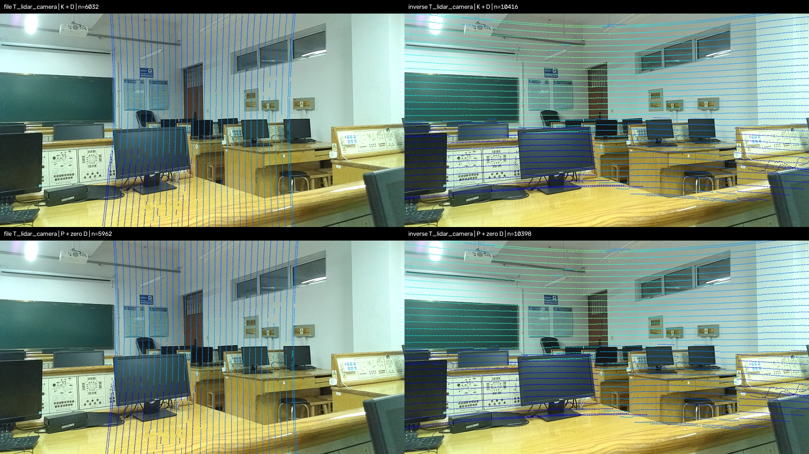

# C32 激光雷达 + OAK 相机：ROS1 项目复现操作手册

> 本页记录早期 bag/通用 YOLO11s 复现过程。当前门框 `best.pt` 与遮挡率的
> 真机部署步骤请使用 [真机实时部署教程](真机实时部署教程.md)。

> **只想用半天尽快跑实时检测：直接按 [实时检测精简手册](实时检测精简手册.md) 的四步执行。下面保留为详细配置和排错参考，不必先完成 bag 回放。**

适用日期：2026-09-13。根据当前目录的项目源码、`bag_0912_152646.bag` 和 `calibration_2026_9_13_3_27_59.txt` 整理。

你已确认小车没有显卡。本手册主线采用 **Ubuntu 20.04、ROS Noetic、x86_64、系统 Python 3.8、CPU 推理**。Ubuntu/ROS/CPU 架构是工作假设，尚未登录小车确认；第一步会检查。Windows 用来查看数据、阅读手册和传文件，ROS 节点在小车上运行。

推荐顺序：**确认环境 → 传文件 → 编译 ROS 包 → 回放 bag 验证投影 → 安装和验证 CPU 推理 → 回放融合 → 接实时传感器**。第一次跑不要同时改变相机分辨率、雷达驱动、外参和聚类参数。

> 当前最需要核对的是外参方向。标定文件第一段矩阵直接用于本 bag 时，扫描线明显竖起；取逆后朝向更合理。因此配套 launch 默认 `invert_extrinsic:=true`，但这只是有离线图像依据的候选配置，**不代表标定精度已经验收**。请先完成第 5 节的静态投影检查。

## 1. 已经从你的文件中确认了什么

### 1.1 bag 的真实内容

文件大小为 **1,271,360,888 字节，约 1.18 GiB**；录制时长 **19.700 秒**，共 **691 条消息**；开始时间为北京时间 **2026-09-12 15:26:46.821**。

| 实际话题 | 消息类型 | 数量 | 录制频率约值 | header.frame_id |
|---|---|---:|---:|---|
| `/stereo_inertial_publisher/color/image` | `sensor_msgs/Image` | 296 | 15 Hz | `oak_rgb_camera_optical_frame` |
| `/velodyne_points` | `sensor_msgs/PointCloud2` | 197 | 10 Hz | `velodyne` |
| `/camera_info` | `sensor_msgs/CameraInfo` | 198 | 10 Hz | **空字符串** |

这些是 **bag 录下的话题全集**，不等于小车当时 ROS 系统发布的全部话题。未录入的驱动参数、设备 IP、ROS 发行版、启动命令，不能从这个 bag 中恢复。

图像：1280×720，`bgr8`，每行 `step=3840` 字节。

点云：有组织点云，`height=32`、`width=2244`，每帧 71,808 个点位；第一帧 70,067 个点坐标有限，其中仍可能包含无效的全零点。`point_step=32`、`row_step=71808`，小端；字段如下：

| 字段 | 类型 | 字节偏移 |
|---|---|---:|
| x | FLOAT32 | 0 |
| y | FLOAT32 | 4 |
| z | FLOAT32 | 8 |
| intensity | FLOAT32 | **16** |

不能把这类数据直接 `reshape(-1, 4)` 当作紧密排列的 x/y/z/intensity。配套读取代码已处理字段偏移、行步长、NaN 和全零点。

虽然话题叫 `/velodyne_points`、frame 叫 `velodyne`，记录中的发布节点是 **`/lslidar_c32_decoder_node`**。这是你的 C32 驱动输出，不需要因此更换成 Velodyne 驱动。

bag **没有 `/tf`、`/tf_static`、`/clock`**。回放时的 `/clock` 由 `rosbag play --clock` 生成。bag 也不保存整棵 ROS 参数树。

### 1.2 相机标定

198 条 CameraInfo 中的内参配置一致，畸变模型为 `plumb_bob`。

```text
K = [[1037.8152830113024, 0, 662.0184000152576],
     [0, 1037.3987810093042, 345.1983182440506],
     [0, 0, 1]]

D = [0.197894310531487,
    -0.3619117732251506,
    -0.0025906913757772635,
     0.01007970097041047,
     0.0]

R = I

P = [[1059.0867919921875, 0, 674.6850258587292, 0],
     [0, 1072.4005126953125, 343.2899240904226, 0],
     [0, 0, 1, 0]]
```

`K+D` 用于对应的原始畸变图像；对于**实际已经按上述 R/P 矫正过**的图像，使用 `P` 的左 3×3 和零畸变。话题名 `/color/image` 本身不能证明图像已经矫正。配套配置默认按原图使用 `K+D`，现场仍要检查相机驱动的图像处理方式。

这组负的 k2 还会使超出标定视野的大角度点发生多项式“折返”，投到图像内部。配套投影先按图像边界的反畸变射线作保守视野预筛选，再计算像素坐标；生成的离线对比图也使用同一处理，避免把 360° 点云的视野外点误当作有效投影。

CameraInfo 的 frame 为空，且由独立的 `/camera_info_publisher` 发布。配套节点直接读取已导出的 YAML，只同步图像和点云，因此不会因这条 CameraInfo 的空 frame 或不同发布频率而无法启动。如果以后改用 `image_proc` 或 RViz 的 Camera 显示，应让上游 CameraInfo 与对应图像具有正确的 optical frame 和时间戳。

### 1.3 外参方向：必须看对比图

标定文本的第一段写明 `P_camera = T_lidar_camera * P_lidar`，数值为：

```text
 0.013392     0.00950979   0.999865    -0.0228991
-0.999908     0.00220851   0.0133715   -0.014805
-0.00208105  -0.999952     0.00953849  -0.0759145
 0           0            0           1
```

但把它直接作用于当前 bag 的点云，会得到明显竖起的扫描线。其逆矩阵接近文本第二段 `T_camera_lidar`，在这个 bag 上扫描线朝向更合理：

```text
 0.013392    -0.999908    -0.00208105  -0.014655
 0.00950979   0.00220851  -0.999952    -0.0756604
 0.999865     0.0133715    0.00953849   0.0238181
 0           0            0           1
```

请打开 [第一组投影对比图](inspection/sample_00_projection_comparison.jpg)。



- 左列：直接使用文件第一段矩阵；右列：使用第一段矩阵的逆。
- 上排：按原图 `K+D` 投影；下排：假设输入已矫正，按 `P+零畸变` 投影。
- 四幅图使用同一张原始图像；下排只是另一种模型假设，**没有把图像重新矫正**。
- 不能靠“图里点更多”判断标定正确，必须看物体边缘、遮挡关系、近远目标是否对应。

这种矛盾可能与标定工具对方向的命名、标定时点云使用的坐标系、或传感器安装状态有关。当前数据不足以确定是哪一种，也没有用于计算重投影误差的角点真值。程序保留原矩阵，并明确提供求逆开关，没有改写你的标定 TXT。

### 1.4 时间戳

按每个点云的 `header.stamp` 找最近的图像，197 帧点云全部能找到差值小于 19 ms 的图像：绝对差中位数约 **16.473 ms**，95 分位约 **18.020 ms**，最大约 **18.259 ms**。三类消息都没有零时间戳或时间倒退。

起步用 `sync_slop=0.05` 秒即可。这里统计的是采集 header 的接近程度，不能证明硬件同步或运动去畸变已经实现。不要把消息到达/录包的延迟当成需要人为补偿的传感器时差，也不要改成 `rospy.Time.now()` 来掩盖同步问题。

完整数值在 [inspection/bag_report.json](inspection/bag_report.json)，逐条 header 时间戳在 [inspection/header_timestamps.json](inspection/header_timestamps.json)。

## 2. 已准备的文件，以及本次复现的范围

| 文件 | 用途 |
|---|---|
| `c32_oak_ros1_bundle.zip` | 可传到小车的代码、配置、权重、手册和检查工具；不含 1.27 GB bag 和 Windows 虚拟环境 |
| `image_pointcloud_fusion/config/c32_oak.yaml` | 你的内参、畸变、原始外参和 CPU 起步参数 |
| `image_pointcloud_fusion/launch/c32_projection.launch` | 只做点云投影；不需要 PyTorch / YOLO / Open3D |
| `image_pointcloud_fusion/launch/c32_fusion.launch` | CPU 融合检测 |
| `image_pointcloud_fusion/rviz/c32_oak.rviz` | 已填好点云、图像和框话题的 RViz 配置 |
| `tools/check_robot.py` | 在小车上检查 ROS/Python 库、cv_bridge、Open3D 和实际 YOLO 权重 |
| `deploy/requirements-noetic-cpu.txt` | Noetic/Python 3.8 的固定版本依赖 |
| `deploy/offline_env.bash` | bag 回放使用独立 ROS master，端口 11321 |
| `tools/inspect_ros1_bag.py` | Windows/Linux 均可运行的无 ROS bag 检查工具 |
| `tools/validate_offline.py` | 几何、点云布局和配置检查 |

主线使用原项目 `imgpc_fusion_detection.py` 的 **分区 DBSCAN 聚类 → 3D 聚类框投影 → 与 YOLO 2D 框按 IoU 匹配**。新增的 `c32_oak_fusion.py` 复用这些算法，负责读取配置、CPU 推理、预先同步、限速、视野裁剪和可视化。

原始 `imgpc_fusion_detection.py` 补了 IoU 零分母处理、可配置 IoU 阈值，以及投影前的相机前方/有效射线范围检查。后一项用于避免这组畸变系数对视野外框角点产生伪投影；视野边缘不完整的聚类框也可能因此被过滤。另补了 package 运行依赖和 catkin 安装规则。

项目已有 **`scripts/yolo11s.pt`，19,313,732 字节**，主线继续使用它，不需要训练。它是通用类别检测权重，能否识别现场目标取决于类别、视角和置信度；不是专门训练的 C32/OAK 三维检测网络。

配套节点的前视野裁剪和 5 cm 体素下采样是 CPU 部署措施，会影响聚类结果。想对照原始预处理，可在 YAML 中设 `crop_to_camera: false`、`voxel_size: 0.0`、`leaf: 1`，同时确保 `max_range` 覆盖希望比较的原算法工作范围，代价是负载更高。

## 3. 先连接小车、确认环境、传文件

### 3.1 Windows PowerShell：连接

先让电脑和小车网络互通。下面账号和 IP 是示例，替换成你小车实际值；本次没有远程登录小车。

```powershell
Set-Location 'D:\document\project\image-pointcloud-fusion-main'
$CarTarget = 'robot@192.168.1.100'
ssh $CarTarget
```

成功后提示符应已变成 Linux 小车上的 shell。密码在 SSH 提示时输入即可。

### 3.2 小车 Linux：检查默认环境是否成立

```bash
cat /etc/os-release
uname -m
/usr/bin/python3 --version
ls /opt/ros
free -h
df -h "$HOME"
nproc
```

预期：Ubuntu 20.04、`x86_64`、Python 3.8.x、存在 `/opt/ros/noetic`。建议预留 8–10 GB 磁盘空间；内存越充足越便于同时开 RViz 和处理图像。

```bash
source /opt/ros/noetic/setup.bash
rosversion -d
```

预期输出 `noetic`。如果实际是 Melodic/Python 2，不能只把后续命令中的 `noetic` 换成 `melodic`：cv_bridge 的 Python ABI 不同；如果是 ARM/aarch64，后面的 x86 CPU wheel 安装命令也不适用。此时应按实际平台适配依赖，今天不要临时重装小车系统。已经有可用 ROS1 时，先保护原来的驱动环境。

若只是当前终端找不到 `rosversion`，先 source 对应 setup；不要据此判断 ROS 没装。

### 3.3 Windows PowerShell：传包和 bag

检查完可用 `exit` 返回 Windows，再执行：

```powershell
ssh $CarTarget 'mkdir -p ~/fusion_inbox'
scp '.\c32_oak_ros1_bundle.zip' "${CarTarget}:~/fusion_inbox/"
scp '.\bag_0912_152646.bag' "${CarTarget}:~/fusion_inbox/"
```

第二条 scp 传的是小包，第三条是约 1.27 GB bag。若小车已经有同一份 bag，可直接使用原文件或复制到 `~/fusion_inbox/`，无需重复传输。传输前确认磁盘空间，等待 scp 正常完成。

不需要把 `.venv-bag` 或整个 Windows Python 目录传过去，Windows 的虚拟环境不能作为 Linux 环境使用。

### 3.4 小车 Linux：解压和校验

```bash
python3 -m zipfile -e ~/fusion_inbox/c32_oak_ros1_bundle.zip ~/fusion_inbox
cd ~/fusion_inbox
sha256sum -c bundle_contents.sha256
sha256sum -c input_checksums.sha256
```

第一份校验代码包内的文件；第二份校验 bag、原始标定 TXT、原始 YOLO11s 权重。均应显示 `OK`。若 bag 放在其他目录，第二份检查会提示找不到 bag，此时对实际 bag 执行 `sha256sum /实际路径/bag_0912_152646.bag`，与 `input_checksums.sha256` 中对应值比较即可。

本包没有预下载 Linux 的 PyTorch/Open3D wheels 或 apt 安装包。**安装依赖需要网络**，或需要你已有的离线软件源；代码包和权重本身齐全不等于 Linux 依赖已经安装。

## 4. 安装 ROS 侧依赖、创建独立工作空间

以下均在小车 Linux 上执行。沿用已安装的 ROS Noetic，不重新安装相机或雷达驱动。

```bash
source /opt/ros/noetic/setup.bash
sudo apt update
sudo apt install -y \
  build-essential cmake python3-venv python3-pip \
  python3-numpy python3-opencv python3-yaml python3-rospkg \
  python3-catkin-pkg python3-empy \
  ros-noetic-catkin ros-noetic-rospy ros-noetic-sensor-msgs ros-noetic-std-msgs \
  ros-noetic-cv-bridge ros-noetic-message-filters \
  ros-noetic-geometry-msgs ros-noetic-visualization-msgs \
  ros-noetic-jsk-recognition-msgs ros-noetic-rviz ros-noetic-rqt-image-view \
  libgl1 libglib2.0-0 libgomp1
```

apt 安装失败时先读错误。若是 ROS 软件源签名/密钥过期或 Ubuntu 源不可达，应修复现有软件源或网络；不要跳过依赖继续猜运行错误。

```bash
mkdir -p ~/fusion_ws/src
cp -a ~/fusion_inbox/image_pointcloud_fusion ~/fusion_ws/src/
chmod +x ~/fusion_ws/src/image_pointcloud_fusion/scripts/*.py
cd ~/fusion_ws
catkin_make -DPYTHON_EXECUTABLE=/usr/bin/python3
source ~/fusion_ws/devel/setup.bash
rospack find image_pointcloud_fusion
roslaunch --nodes image_pointcloud_fusion c32_projection.launch
```

预期 `rospack find` 指向 `~/fusion_ws/src/image_pointcloud_fusion`，launch 能解析出 `/c32_projection`。本项目是 Python 节点，catkin 编译主要负责包发现和脚本/资源安装。

这一步使用系统 `/usr/bin/python3`。不要在 Conda 环境或 Windows Python 环境里编译 ROS 工作空间。也不需要把 source 命令反复追加到 `.bashrc`；按本手册在需要的终端 source 即可。

先验证纯投影所需依赖：

```bash
cd ~/fusion_inbox
/usr/bin/python3 tools/check_robot.py --mode projection
```

必须看到 `PASS cv_bridge roundtrip` 和最终 `RESULT: PASS`。该检查不需要启动 roscore。

## 5. 首先回放 bag，验收纯投影

### 5.1 为什么用独立 master

bag 回放要开启模拟时间。这里使用 **11321 端口的独立 ROS master**，避免把小车原来 11311 master 上的驱动/控制节点切到历史时间。

以下 A/B/C/D 都是**小车上的终端**，可以是多条 SSH 会话；RViz 所在的 C 终端需要小车本地桌面或已有的远程桌面。普通 SSH 终端通常没有图形显示环境。

**终端 A：启动回放专用 master。**

```bash
source ~/fusion_inbox/deploy/offline_env.bash
roscore -p 11321
```

保持该终端运行。若 11321 已有你此前启动的回放 master，复用它即可，不要重复启动。

**终端 B：启动纯投影。**

```bash
source ~/fusion_inbox/deploy/offline_env.bash
rosparam set /use_sim_time true
roslaunch image_pointcloud_fusion c32_projection.launch
```

默认读取你的 YAML，使用第一段外参的逆、原图 `K+D`。看到 `Projection ready` 表示节点初始化完成，尚未表示投影正确。

**终端 C：在小车桌面打开 RViz。**

```bash
source ~/fusion_inbox/deploy/offline_env.bash
rviz -d "$(rospack find image_pointcloud_fusion)/rviz/c32_oak.rviz"
```

**终端 D：播放 bag。**

```bash
source ~/fusion_inbox/deploy/offline_env.bash
rosbag info ~/fusion_inbox/bag_0912_152646.bag
rosbag play --clock --pause -r 0.2 ~/fusion_inbox/bag_0912_152646.bag
```

`--pause` 会先暂停。节点和 RViz 就绪后，在 **D 终端按空格** 开始，再按空格可暂停。0.2 倍速让 19.7 秒 bag 播放约 98.5 秒墙钟时间，便于 CPU 处理和观察。

回放时这些话题来自 bag，不要再往这个 master 上启动同名实时图像/点云发布者。

### 5.2 应该看到什么

RViz 的 Fixed Frame 已设为 **`velodyne`**。显示项如下：

- `C32 original points`：`/velodyne_points`，可见实验室点云。
- `Projection`：`/c32_projection/overlay_image`，可见图像和按相机深度着色的点。
- 融合阶段的框话题此时还没有数据，属于正常现象。

图像左上角显示可见点数及 `image-lidar` header 差。终端 B 每隔一段时间输出 `Projection: ... visible points`。深度图 `/c32_projection/depth_image` 是 `32FC1`，单位按米、数值为相机 Z 深度，0 表示无投影点；默认抽取部分点用于检查，因此它是稀疏深度图。

手动配置 RViz 时要添加 **Image** 显示项，不要在这一阶段换成 **Camera** 显示项；后者会额外依赖 CameraInfo/TF。

也可用新终端检查，记得先 source 回放环境：

```bash
source ~/fusion_inbox/deploy/offline_env.bash
rostopic list
rostopic echo -n 1 /velodyne_points/header
rostopic echo -n 1 /stereo_inertial_publisher/color/image/header
rostopic hz /c32_projection/overlay_image
```

0.2 倍回放按墙钟约为图像 3 Hz、点云 2 Hz；部分 ROS 频率工具按模拟时间计算，可能仍显示原始 15/10 Hz。重点是有连续输出、header 差合理、没有报错。

### 5.3 外参和畸变模型的切换方法

先 Ctrl+C 停掉 B 中的投影节点，再按需要启动同一个节点。不要同时开两个同名投影节点。

```bash
# 候选一：本手册默认，第一段矩阵求逆，按原图 K+D 投影
roslaunch image_pointcloud_fusion c32_projection.launch \
  invert_extrinsic:=true image_is_rectified:=false

# 候选二：严格按文本第一段公式，直接使用该矩阵
roslaunch image_pointcloud_fusion c32_projection.launch \
  invert_extrinsic:=false image_is_rectified:=false

# 只有确认输入图像实际已按相同 R/P 矫正时，才这样选
roslaunch image_pointcloud_fusion c32_projection.launch \
  invert_extrinsic:=true image_is_rectified:=true
```

上述三条是**三种替代启动方式，一次只执行一种**。`image_is_rectified` 只选择数学投影模型，不会对图像进行去畸变。

如果 bag 已播放完，停止 D 中播放器，停止 B 中节点，再重新启动 B 和 D。第一次不要用 `rosbag play -l` 循环：每轮时间跳回开头可能导致同步缓存、RViz 和日志节流出现干扰。

### 5.4 几何验收标准

先利用 bag 比较桌沿、显示器边缘和墙面，再在实时阶段让小车静止，用能被雷达稳定照到的纸板/箱子或静止的人，在约 2 米、4–5 米及画面左右侧分别验证。

通过标准是物体轮廓和对应点云边界大体贴合，近远与左右位置都合理；不是“图像上有点”。反光/透明表面、遮挡边界及机械雷达一圈扫描的时间跨度可能带来局部差异。

若整体转了 90°、上下倒置或左右明显错位，先核对外参方向与标定时使用的点云 frame。若中央较好而边缘偏离，检查原图/矫正图模型和分辨率；若误差随距离变化明显，检查平移、单位、传感器是否移动过。不要用随意修改 `fx/cx` 的办法补偿错误外参。

如果两个外参方向都不能让目标贴合，说明当前外参与这路 bag/驱动输出还不匹配。此时可以继续检查 YOLO 软件环境，但不能把后面的三维框当作融合复现已经成功。

## 6. 安装 CPU 推理环境，单独验证 YOLO

### 6.1 创建能访问 ROS 系统库的虚拟环境

新开一个小车终端，不使用 Conda。这里的 `--system-site-packages` 用于访问 apt 安装的 cv_bridge 等 ROS 依赖。

```bash
source /opt/ros/noetic/setup.bash
/usr/bin/python3 -m venv --system-site-packages ~/venvs/fusion_cpu
source ~/venvs/fusion_cpu/bin/activate
python --version
python -c "import sys; print(sys.executable)"
python -m pip install --upgrade pip==25.0.1 setuptools==69.5.1 wheel==0.45.1
python -m pip install numpy==1.24.4
```

预期 Python 3.8，解释器位于 `/home/你的用户/venvs/fusion_cpu/bin/python`。

先安装匹配的 PyTorch **CPU wheel**，再装其他依赖：

```bash
python -m pip install \
  torch==2.2.2+cpu torchvision==0.17.2+cpu \
  --index-url https://download.pytorch.org/whl/cpu

python -m pip install \
  -r ~/fusion_inbox/deploy/requirements-noetic-cpu.txt \
  -c ~/fusion_inbox/deploy/constraints-noetic-cpu.txt

python -m pip check
```

主要版本组合是 NumPy 1.24.4、OpenCV 4.10.0.84、Open3D 0.18.0、Ultralytics 8.3.0、Torch 2.2.2+cpu、Torchvision 0.17.2+cpu。这里固定版本是为了适配 Noetic 的 Python 3.8 和 ROS 二进制扩展，不要在现场直接 `pip install -U numpy torch ultralytics`。

Open3D/PyTorch 下载可能是最耗时的一步。先保证小车能访问软件源；普通 apt 成功不代表一定能访问 PyTorch 下载站。pip 操作都放在这个虚拟环境中，**不使用 sudo pip**。若 `pip check` 报错，先处理涉及本项目的 torch/torchvision、NumPy、OpenCV、Open3D、Ultralytics 的版本冲突；系统中其他已有 Python 包也可能被该命令列出。

### 6.2 使用实际权重和 bag 图像做检查

```bash
source /opt/ros/noetic/setup.bash
source ~/fusion_ws/devel/setup.bash
source ~/venvs/fusion_cpu/bin/activate
cd ~/fusion_inbox
python tools/check_robot.py --mode fusion \
  --model "$(rospack find image_pointcloud_fusion)/scripts/yolo11s.pt" \
  --image ~/fusion_inbox/inspection/sample_00_image.png
```

应看到：

1. 所有模块 `OK import`，包括 `cv_bridge`、`torchvision`、`open3d`、`jsk_recognition_msgs.msg`。
2. `PASS cv_bridge roundtrip`。
3. `PASS Open3D DBSCAN`。
4. `PASS local YOLO weight` 和预热后的 CPU 单帧耗时。
5. 最终 `RESULT: PASS`。

检查结果保存在 `~/fusion_inbox/robot_checks/check_fusion.json`，二维检测图片为 `cpu_yolo_check.jpg`。`torch_cuda_available: false` 对你的无显卡小车是正常结果。

如果图上没有识别框，但推理完成且没有异常，不一定是安装失败；这张 bag 图像是实验室场景，目标类别和阈值会影响结果。CPU 计时这里只包含二维检测，完整融合还要加上点云处理和 ROS 开销。

主线不承诺 10/15 FPS。先以 1–2 个处理结果/秒为演示起点，实测再调。若 YOLO 单帧已明显超过 0.5 秒，后面可直接用 `imgsz:=320 max_hz:=1.0`。

安装和检查完成后，记录环境：

```bash
python -m pip freeze > ~/fusion_inbox/robot_checks/pip_freeze_cpu.txt
deactivate
```

启动融合的 launch 会明确调用该虚拟环境的 Python，因此不依赖你是否在 launch 终端执行过 `activate`。

## 7. 在 bag 上运行融合检测

继续使用第 5 节的 **11321 回放 master**。在 B 停掉纯投影以节省 CPU；如 bag 已结束，先停播放器。不要另开第二个 master。

**终端 B：**

```bash
source ~/fusion_inbox/deploy/offline_env.bash
roslaunch image_pointcloud_fusion c32_fusion.launch
```

启动会先读取本地权重并预热，看到 `CPU fusion ready` 后再播放 bag。默认等价于：

```bash
roslaunch image_pointcloud_fusion c32_fusion.launch \
  invert_extrinsic:=true image_is_rectified:=false \
  imgsz:=416 max_hz:=2.0 confidence:=0.35 iou:=0.3
```

这里要使用你在投影阶段确认的**同一组** `invert_extrinsic` / `image_is_rectified` 值；如果第 5 节最后选了别的组合，应在融合启动命令中明确传入。

**终端 D：**

```bash
source ~/fusion_inbox/deploy/offline_env.bash
rosbag play --clock --pause -r 0.2 ~/fusion_inbox/bag_0912_152646.bag
```

在 D 按空格播放。RViz 中取消勾选 `Projection`，勾选 `Fusion image - enable during fusion`。`Classified 3D boxes` 保持开启。

### 7.1 输出话题及其含义

| 话题 | 类型 | 说明 |
|---|---|---|
| `/c32_fusion/yolo_image` | Image | 仅 YOLO 二维框，便于单独排查识别 |
| `/c32_fusion/detection_image` | Image | 二维框以及点云聚类框投影的融合图像 |
| `/c32_fusion/cloud_filtered` | PointCloud2 | 过滤/降采样后的点云；有人订阅时才生成发布 |
| `/c32_fusion/all_cluster_markers` | MarkerArray | 所有聚类的调试框；RViz 默认关闭 |
| `/c32_fusion/cluster_markers` | MarkerArray | 成功匹配 YOLO 类别的三维框和文字 |
| `/c32_fusion/bounding_boxes3d` | jsk_recognition_msgs/BoundingBoxArray | 匹配后的三维框数值，坐标在点云 frame 下 |
| `/c32_fusion/cluster_poses` | PoseArray | 匹配聚类的质心 |

3D 框在 `velodyne` 中发布，RViz Fixed Frame 仍用 `velodyne`，无需为了显示这些框添加 TF。使用标准 MarkerArray 显示即可，不需要额外安装 JSK 的 RViz 显示插件。

`cloud_filtered` 沿用原项目输出方式，intensity 填 0；若该点云看起来全黑，请在 RViz 将它的 Color Transformer 改为 FlatColor 或 AxisColor。

另开终端检查：

```bash
source ~/fusion_inbox/deploy/offline_env.bash
rostopic hz /c32_fusion/detection_image
rostopic echo -n 1 /c32_fusion/bounding_boxes3d
```

终端 B 的日志包含：每对数据处理耗时、header 时间差、点数变化、聚类数和 YOLO 检测数。`max_hz` 是希望限制的最高处理频率，CPU 跟不上时实际频率会更低；节点只保留有限数量的已同步数据，避免无限积压。

### 7.2 二维框出现了，但三维框没出现

先在 RViz 勾选 `All clusters - enable for debugging`，按这个顺序判断：

1. 没有有效聚类：看 `/cloud_filtered` 是否有点，检查高度范围、距离限制、体素大小及聚类最小点数。
2. 有聚类但位置不对应图像：回到纯投影核对几何，先不降低匹配阈值。
3. 聚类对应目标，但投影框与 YOLO 框形状差异较大：可能是点云稀疏、目标被遮挡、与桌面/墙壁粘连，导致 IoU 不足。
4. YOLO 本身没有识别目标：看 `/yolo_image` 和预检输出，换静止的人/箱子等合适目标，确认通用类别权重能检测到。

当前旧 bag 是实验室桌椅/显示器场景，聚类容易合并背景；它可以验证数据链路和几何，不保证每个二维检测都会对应三维框。现场最好让一个人静止站在相机前方 2–4 米，并与墙、桌子留开距离，再观察匹配结果。

只用于排查匹配问题时，可以重启节点尝试 `iou:=0.15`。降低阈值会增加错误匹配，不能用它来“修好”不正确的外参。

## 8. 从 bag 切到小车实时运行

### 8.1 切回实时驱动所在的 ROS master

停止回放终端 D、融合 B 和回放 RViz。结束该回放实验后可 Ctrl+C 停止 A 中的 11321 master。

用你以前能正常在 RViz 看见 C32 和 OAK 的方式启动两路驱动。现有 bag 只告诉我们发布节点名 `/lslidar_c32_decoder_node` 和 `/stereo_inertial_publisher`，没有保存 launch 文件名；因此这里不猜一条可能与你驱动版本不符的启动命令。

在原先用于启动驱动的终端查看：

```bash
echo "$ROS_MASTER_URI"
rosnode list
rostopic list
```

若需要找原启动方式，可以在原驱动环境中检查 shell 历史、已有启动脚本，以及：

```bash
rospack list | grep -Ei 'lslidar|depthai|oak'
ps -eo args | grep -E 'roslaunch|lslidar|stereo_inertial'
```

先恢复既有驱动能独立输出图像和点云，再接融合。C32 的设备 IP、网卡、端口、转速、时间源，以及 OAK 的型号/USB/驱动参数，都无法从这三个录制话题推导出来；沿用已正常录包的配置。

### 8.2 新开实时融合终端

**不要 source `offline_env.bash`。** 下面按驱动在本机默认 11311 master 举例；若上一步输出不同，以实际驱动的 `ROS_MASTER_URI` 为准。

```bash
source /opt/ros/noetic/setup.bash
source ~/fusion_ws/devel/setup.bash
export ROS_MASTER_URI=http://127.0.0.1:11311
echo "$ROS_MASTER_URI"
rosnode list
rostopic info /velodyne_points
rostopic info /stereo_inertial_publisher/color/image
rosparam get /use_sim_time
```

应能看见实时驱动节点和发布者。`use_sim_time` 应为 `false`，或参数未设置（默认 false）。如果是 true，先确认这个 master 没有需要模拟时间的其他任务，再在停止相关 bag 回放后设置：

```bash
rosparam set /use_sim_time false
```

这里保持原本已经工作正常的 ROS 网络配置。所有大数据处理和 RViz 尽量在小车上执行；SSH 用于命令和传文件。不要把 ROS_MASTER_URI 改成 Windows 的地址，除非那里确实运行了你有意使用的 ROS master。

### 8.3 对比实时数据是否仍与标定一致

```bash
rostopic hz /velodyne_points
rostopic hz /stereo_inertial_publisher/color/image
```

两条 `hz` 是前台命令，每看几秒 Ctrl+C 后再执行下一条。

```bash
rostopic echo -n 1 /velodyne_points/header
rostopic echo -n 1 /stereo_inertial_publisher/color/image/header
rostopic echo -n 1 /stereo_inertial_publisher/color/image/width
rostopic echo -n 1 /stereo_inertial_publisher/color/image/height
rostopic echo -n 1 /stereo_inertial_publisher/color/image/encoding
rostopic echo -n 1 /camera_info
```

预期仍是 1280×720、`bgr8`、图像 frame 为 `oak_rgb_camera_optical_frame`、点云 frame 为 `velodyne`；相机配置与第 1 节一致。若 `/camera_info` 的独立发布脚本未启动，最后一条会等待；此时可 Ctrl+C。融合节点本身用 YAML 中的内参，但仍需确认相机工作模式没有变。

适配节点会拒绝分辨率或 frame 名不匹配的数据，避免默默输出错位结果。frame 名改变时，先确认驱动没有同时旋转/变换坐标，再修改 YAML；**改 frame 字符串不会改变点坐标**。

确认内外参标定对应的是这一路 OAK RGB 镜头，而不是左右目。若你的 OAK RGB 型号带自动对焦，应保持标定时的对焦位置；改变镜头位置、图像裁剪或相机/雷达安装位置，都可能让旧标定失效。

### 8.4 实时先投影，再融合

```bash
roslaunch image_pointcloud_fusion c32_projection.launch \
  invert_extrinsic:=true image_is_rectified:=false
```

在小车桌面新终端 source 同一 ROS/workspace 环境、设置同一实时 master，再打开 RViz 配置。保持小车静止，完成第 5.4 节的近远目标检查。

通过后 Ctrl+C 停止投影，启动 CPU 融合：

```bash
roslaunch image_pointcloud_fusion c32_fusion.launch \
  invert_extrinsic:=true image_is_rectified:=false \
  imgsz:=416 max_hz:=2.0
```

如果实际验收采用了不同的外参/图像模型开关，两条命令都使用验收后的值。只改话题名时，可直接传参，例如：

```bash
roslaunch image_pointcloud_fusion c32_fusion.launch \
  camera_topic:=/你的实际图像话题 lidar_topic:=/你的实际点云话题
```

上述中文话题是占位示例，不是可以原样执行的命令。若实时只发布 `sensor_msgs/CompressedImage`，本节点不能直接订阅它，应先让驱动提供原始 `sensor_msgs/Image` 或用 image_transport 解压到 Image 话题，再指定 `camera_topic`。

## 9. CPU 调参与现场排查

### 9.1 优先调整的参数

先记下原值，一次只改一组，并重启对应节点；大多数参数只在初始化时读取。运行时 `rosparam set` 不会自动让已运行节点重新加载配置。

| 现象/需求 | 调整方式 | 注意 |
|---|---|---|
| CPU 慢、RViz 卡 | launch 加 `imgsz:=320 max_hz:=1.0` | 先减负载，不承诺固定 FPS |
| 点云处理仍慢 | YAML `voxel_size: 0.07` 或 `0.10`，`max_range: 10.0` | 会减少远处/小目标点数 |
| 地面聚成大块 | 调整 `z_axis_min` | 雷达离地高度为 h 时，地面通常接近 z=-h；可从 `-h+0.10~0.20` 起试，前提是该 frame 的 z 向上 |
| 人/物体被高度过滤截断 | 检查 `z_axis_min/max` | 坐标是雷达 frame，不是地图地面坐标 |
| 目标点云过少 | 减小 voxel 或聚类最小点数 | `cluster_size_min` 同时影响原算法 DBSCAN 的邻域点数和簇大小 |
| 聚类把墙/桌子粘在一起 | 看全部聚类，检查高度/距离/场景 | 不能只把 `cluster_size_max` 无限调大 |
| 二维检测漏检 | 尝试 `confidence:=0.25` 或提高 imgsz | 提高分辨率会更慢，降低阈值会增加误检 |
| 只有三维关联少 | 几何正确后尝试 `iou:=0.15` 排查 | 原主线值为 0.3；阈值低更容易错配 |

`imgsz` 是 YOLO 内部推理尺寸；Ultralytics 返回的框已映射回输入图像尺寸，因此**仅改变 imgsz 不需要缩放 K**。真正修改 OAK 输出分辨率、裁剪区域或图像处理流程时，才需要对应的新内参/坐标处理。

原项目的 `leaf` 是“每隔多少个点取一个”的**整数步长**，不是以米为单位的体素边长。配套节点另用 `voxel_size` 表示米制体素尺寸，主线保持 `leaf=1`。

`sensor_model: HDL-32E` 只选原算法预设的距离分区宽度，不配置硬件，也不代表 C32 与 HDL-32E 扫描特性完全相同。首次沿用这个 32 线起步分区；后续可根据 C32 点密度调聚类参数。

若 11s 在小车上仍过慢，可在有网时另行准备较小的 YOLO11n 权重，再通过 `model:=/绝对路径/yolo11n.pt` 指定。该文件不包含在当前包里；改用 11n 会改变检测效果，不能与原项目 11s 的结果直接视为相同。

### 9.2 常见故障对照

| 症状 | 优先检查/处理 |
|---|---|
| `package not found` | 每个终端 source `~/fusion_ws/devel/setup.bash`；用 `rospack find image_pointcloud_fusion` 确认找到本次副本 |
| 找不到节点、Permission denied | 确认 catkin_make 成功；执行 scripts 下 Python 文件的 `chmod +x` |
| `python3\r` / bad interpreter | 文本被改成 CRLF；按下面的换行修复方法处理后重编译 |
| `No module named rospy/cv_bridge` | source ROS；融合使用 `~/venvs/fusion_cpu/bin/python`；venv 必须用系统 Python 创建并包含 system-site-packages |
| `numpy.core.multiarray` / `_ARRAY_API` | 检查是否混入 NumPy 2；按约束文件在 venv 内恢复 NumPy 1.24.4，并重新运行 cv_bridge 检查 |
| `libGL.so.1` / `libgomp.so.1` 缺失 | 检查 apt 的 `libgl1`、`libgomp1` 是否装好 |
| `em.RAW_OPT` / empy 相关编译报错 | catkin 使用 `/usr/bin/python3` 和 apt 的 python3-empy；不要让 Empy 4 替换 ROS 所需版本 |
| `C3k2` / YOLO11 模块找不到 | Ultralytics 太旧或启动用了错误 Python；用固定的 8.3.0 环境和 check_robot 验证 |
| `torchvision::nms` 相关报错 | torch/torchvision 二进制版本不匹配；恢复 2.2.2+cpu / 0.17.2+cpu 配对 |
| 模型文件不存在 | 用绝对路径或默认 launch；确认 scripts/yolo11s.pt 已传输，权重不是 Git LFS 的文本占位文件 |
| `No synchronized pair` | 确认 bag 已按空格播放、两路话题都有数据、终端使用同一 master，再看原始 header 时间差 |
| 有输入但时间差很大 | 检查驱动时间源/设备时钟与系统时钟；不要把 slop 扩到几秒或直接重写时间戳来凑对 |
| bag 播完后不再输出 | 正常；节点在等下一对消息。重播时按第 5 节重启节点与播放器 |
| RViz 提示 Fixed Frame 不存在 | 有点云后使用其真实 header.frame_id；bag 中为 velodyne，不要设置 map/odom/camera |
| RViz 图像空白 | 显示项选 Image，填正确输出话题；对应阶段启用 Projection 或 Fusion image |
| 框只闪一下或看不到 | 检查输出频率、显示话题和 Fixed Frame；适配节点已将 marker 生命周期设为 1.5 秒并在每帧清理旧框 |
| 图像有框、三维框为空 | 区分 YOLO、聚类、外参和 IoU；先看 all_cluster_markers，不要只看最终框 |
| 纯 SSH 启动 RViz 报显示错误 | 到小车本地桌面/已有远程桌面启动 RViz，融合节点可以继续在 SSH 中运行 |

如确实发生 CRLF 换行问题，在小车上执行以下修复，仅处理本包 Python 源文件：

```bash
python3 - <<'PY'
from pathlib import Path
folder = Path.home() / 'fusion_ws/src/image_pointcloud_fusion/scripts'
for path in folder.glob('*.py'):
    raw = path.read_bytes()
    path.write_bytes(raw.replace(b'\r\n', b'\n'))
PY
chmod +x ~/fusion_ws/src/image_pointcloud_fusion/scripts/*.py
cd ~/fusion_ws
catkin_make -DPYTHON_EXECUTABLE=/usr/bin/python3
```

### 9.3 参数位置和 TF 两个容易混淆的细节

真正运行的 YAML 在 `~/fusion_ws/src/image_pointcloud_fusion/config/c32_oak.yaml`。不要只修改 `~/fusion_inbox/` 中的传输副本，然后以为运行参数已经改变。

launch 会覆盖 YAML 中的同名参数：两种 launch 都覆盖 `invert_extrinsic`、`image_is_rectified`、`camera_topic`、`lidar_topic`、`sync_slop`；融合 launch 还覆盖模型路径、device、imgsz、频率、confidence 和 IoU。**这些项用 launch 参数传入**；其余项在 YAML 修改。可用下面命令查看最终加载结果：

```bash
rosparam get /c32_fusion
```

节点用数值矩阵直接投影，不从 TF 自动获取或替换外参。仅发布一个 TF 不会修好错误的 YAML。

如果以后确实需要补相机和雷达之间的 TF：数学投影用的 `T_C_L` 将雷达坐标变到相机 optical 坐标；以雷达为 parent、相机为 child 的 TF 中存的是相机在雷达下的姿态，即 `T_L_C = inverse(T_C_L)`。先确认方向和标定精度，并检查相机 optical frame 是否已经有父 frame，避免给同一个 child 发布两套父子关系。本次 RViz 方案不需要补这个 TF。

## 10. 保存结果，便于复查

在实时融合所在的 master 环境中执行：

```bash
mkdir -p ~/fusion_runs
rosparam dump ~/fusion_runs/c32_fusion_params.yaml /c32_fusion
~/venvs/fusion_cpu/bin/python -m pip freeze > ~/fusion_runs/pip_freeze_cpu.txt
rosbag record --duration=20 -O ~/fusion_runs/c32_oak_live.bag \
  /velodyne_points /stereo_inertial_publisher/color/image /camera_info \
  /c32_fusion/bounding_boxes3d /c32_fusion/cluster_markers /tf /tf_static
```

这会录制约 20 秒，原始图像和点云可能再占 1 GB 以上，先确认空间；再次记录请换输出文件名。保存一张 RViz 截图，并记下 `invert_extrinsic`、`image_is_rectified`、点云/图像频率、CPU 每对数据处理耗时和现场目标距离。

## 11. 原始脚本怎么对应本次流程

| 原脚本 | 实际作用 | 本次处理 |
|---|---|---|
| `pc2img_projection.py` | 点云投影与深度图，原来写死内外参/输入话题 | 使用支持本次参数和畸变的 `c32_oak_projection.py` 做检查 |
| `camera_lidar_detection.py` | YOLO 2D 框内取点云，直接求 3D 包围盒 | 可理解为按图像区域关联；容易把目标后方背景一起包进去，主线不以它验收后融合 |
| `fusion_detection.py` | 点云聚类、YOLO、投影框 IoU 匹配，显示较多聚类 | 保留供对照 |
| `imgpc_fusion_detection.py` | 类似后融合，主要显示已分类聚类 | 本次适配节点复用它的核心方法 |

原项目没有自动读取 CameraInfo 的完整部署流程，也没有处理你的 C32/OAK 配置的现成 launch。单纯 remap `/livox/lidar` 和 `/camera/color/image_raw` 无法解决内参、畸变、外参方向和 CPU 时序问题。

原后融合代码分别处理图像和点云，再匹配“最近完成的处理结果”。CPU 上推理耗时不对称时容易丢掉本来可配对的数据。本次适配在推理前按原始 header 同步，再将成对数据送入有限队列；YOLO 与聚类算法的关联原则仍沿用原项目。

## 12. 已验证的范围与下午的完成标准

Windows 上已经实际完成：完整读取 691 条消息、导出所有话题和内参配置、核查时间戳、生成 3 组真实图像/点云对比图、检查外参旋转矩阵有效性，以及 10 项离线测试和 Python 语法检查。

尚未在你的小车上完成：Linux 依赖安装、catkin/roslaunch 实际启动、真实 YOLO CPU 速度、RViz 显示和实时几何精度验证。版本组合与代码检查不能替代现场运行；手册中的 check_robot 和分阶段验收就是用来补齐这些检查。

下午可按三个层次记录结果：

1. **数据链路跑通**：实时/回放 Image 与 PointCloud2 正常，投影持续输出，时间差合理。
2. **软件融合跑通**：CPU 模型检查通过，聚类/YOLO/融合话题持续输出，空检测也有正常输出且无异常。
3. **几何和目标验证通过**：静态近远目标投影贴合，独立目标能产生位置合理的三维框，记录参数和现场数据。

外参方向矛盾需要在第 3 层明确解决。只完成前两层时，应记录为“链路和软件已跑通，标定仍待确认”。

## 附：以后在 Windows 重新读取 bag

当前目录已创建 `.venv-bag`，本次实际用它运行过检查。在 PowerShell 中直接执行下面这一整行：

```powershell
.\.venv-bag\Scripts\python.exe -X utf8 tools\inspect_ros1_bag.py bag_0912_152646.bag --calibration calibration_2026_9_13_3_27_59.txt --output inspection --samples 3
```

在新电脑重建读取环境时执行：

```powershell
python -m venv .venv-bag
.\.venv-bag\Scripts\python.exe -m pip install rosbags==0.11.5 opencv-python-headless==5.0.0.93
```

rosbags 0.11.5 要求 Python >=3.10，本次读取实际使用 Windows 的 Python 3.14。因此不要在 Noetic 的 Python 3.8 环境里按这一组版本安装读取工具；Linux 如需使用它，另建符合版本要求的环境即可，小车主线回放使用自带的 rosbag 命令。

此 Windows 读取环境与小车运行环境用途不同，不要将其依赖版本用于 ROS Noetic。读取工具不修改 bag/标定原文件，检查结果写入 `inspection/`。
